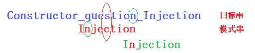

# 字符串匹配

本部分的主要内容是字符串的匹配。

首先通过一个示例明确几个概念，假设x、y、z分别是三个字符串，那么对于这三个字符串的组合来说：

* **模式字符串（模式串）**：待搜索的字符串，比如说我们想在一个字符串xzy中搜索z，那么z就是模式串；
* **文本**：还是上例，xzy就是待搜索的文本；
* **前缀**：对于xyz字符串来说，x就是它的一个前缀，xy也是一个前缀，但是xyz不能被当做前缀；
* **后缀**：对于xyz字符串来说，z就是它的一个后缀，yz也是一个后缀，但是xyz同样不能被当成一个后缀；
* **元素**：对于xyz字符串涞水，y就是它的一个元素。

## 1. 字符串搜索的三种基本方法

字符串搜索有三种基本方法：前缀搜索、后缀搜索和子串搜索。

### 1.1 前缀搜索

#### 1.1.1 KMP算法

这个算法的核心就是对**模式串**进行处理，找到所有**模式串前缀**中前缀和后缀相同的位置，生成一个记录位置的next数组，这样在用**模式串的前缀**与**文本的后缀**进行匹配的时候，如果有一个字符不匹配，可以通过next数组找到上一个与当前**文本的后缀**相同的**模式串的前缀**继续进行匹配，而不需要在从**模式串的开始**重新进行匹配，从而提高了字符串查找的效率。

对于next数组的预处理的时间复杂度是O(m)，对于查找匹配来说的时间复杂度是O(n)。

#### 1.1.2 Shift-And算法

在字符串匹配算法的实践中，有一个结论是思想越简单的算法，其实际效率往往也越高。而相比于KMP算法来说，Shift-And算法和Shift-Or算法的思想相对来说就很简单。

在Shift-And算法中，使用到了几个变量：

* `long[]`的`bitmaps`：这个数组用于保存**所有**字符在**模式串**中出现的位置的位图，比如在模式串“annimal”中，`bitmaps['a']=100001`，`bitmaps['n']=110`，`bitmaps['i']=1000`，`bitmaps['m']=10000`，`bitmaps['l']=1000000`。而其他所有未出现字符的位图值都是0.如果字符集支持的字符很多的话，这种方法可能就会消耗很多多余的空间。
* `long`类型的`mask`：代表了当前匹配的状态（也就是成功匹配到模式串的第几个字符），算法中mask的有效位数就是模式串的长度`pattern.length()`。当`mask`的第`pattern.length() - 1`位为1的时候，就完成了字符串的匹配。而这个值使用了`long`类型，也就说明了如果模式串的长度如果大于了64位，这种方法就不再适用了。

算法的过程就是从**文本**中挨个读取字符，查找读取到的字符的位图，通过如下公式计算`mask`的值：`mask = ((mask << 1) | 1) & bitmaps[curChar]`。

这样就可以在mask中记录已经成功匹配到的位置，如果当前字符不匹配，那么当前匹配到的位就会被清零。`mask`中1的意义是本次以及本次之前读入的字符在模式串中出现的位置是正确的。

因此当mask的第`pattern.length() - 1`位为1的时候，就证明了该模式串在文本中出现了。

### 1.2 后缀匹配算法

后缀匹配算法就是在一个比较窗口中从后向前匹配字符，比较常见的后缀匹配算法有Boyer-Moore算法以及其简化版算法Horspool算法。

BM算法的核心就是在比较窗口中从后向前比较，如果遇到不相同的字符即**坏字符**，分成两类情况来进行，对于两种情况，比较窗口分别移动不同的距离。

1. 遇到的字符没有出现在模式串中：这个时候就将窗口的开头（模式串的最前面）移动到这个坏字符的下一个位置。
2. 如果遇到的坏字符出现在pattern中，那么就找到pattern中该字符出现的最右边的位置，并将pattern的该位置移动到这个坏字符处。

如果只是用上述的坏字符原则的话是会有问题的，因为只记录了坏字符出现在pattern最右侧的坏字符，这样就可能导致比较的倒退，进入死循环。

在BM算法中，**坏字符**原则要配合**好后缀**原则使用。好后缀原则大致与坏字符原则差不多，需要找到当前窗口后缀在pattern中出现过的位置，这部分是BM算法中最复杂的部分，详见[代码及注释](../src/chapt1/BoyerMoore.java)。

因为寻找好后缀方法的复杂性，有人提出了省略掉这一步的算法，在BM算法的基础上进行了优化，这就有了Horspool算法和Sunday算法。Horspool算法仅仅使用了坏字符原则，加入说在一个字符串content中找一个字符串pattern。在比较窗口中，只对窗口的最后一个字符使用坏字符原则，就是说，如果在一个窗口匹配的过程中，匹配失败，则在pattern中找有没有比较窗口中的content的最后一个字符，如果有，就将这个字符移动到这个窗口最后一位的位置，下面是一个简单的示意：

